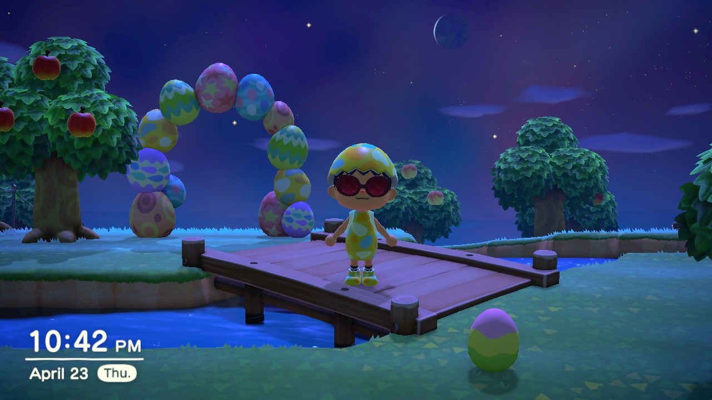

## Scrambled Egg-Is-Thick or Eth-ics?
Back in the day, I used to be a Boy Scout. I attended many hikes, service projects, and camps. Eventually I became an Eagle Scout. The catch is that I was one of the few Eagle Scouts that absolutely hated eggs! I have always despised how bland, dry, and chewy the scrambled eggs were, especially at Boy Scout camps when the new kids were cooking! At first, I had to eat them in little chunks, gagging after every spoonful. As I grew older, I eventually began to recognize two things. First, I could smother eggs with ketchup and salt to avoid both the traumatic memories and the awful taste. Secondly, I acknowledged them as an essential evil—eggs help to fill you up and give you energy to tackle a busy, stressful day.

In many cases, I find eggs to be like ethics. Both may tend to make individuals uncomfortable, but they are necessary for a good, productive, and fair society. In all seriousness, ethics in the context of software engineering are essential as our developing society becomes increasingly dependent on the automation and assistance provided by computers. To me, ethics in software engineering means to both be technically proficient in the work that one produces, and to minimize related risks. Continued development of technical proficiency is a must, but a software engineer also needs to think about the physical, mental, and social implications of their work. As displayed in the case studies mentioned in the next section, we find that software can be used for morally controversial issues and decisions. In software engineering, we must recognize conflicts of interests and operate in the best interest of the world as a whole.

## No Eggs, No Ethics
In the Case Studies featured in the module, we looked at harassment via virtual applications, ethical decision making in Artificial Intelligence, and poorly defined lines in regards to privacy of data. I found the [The Code I'm Still Ashamed of](https://medium.freecodecamp.com/the-code-im-still-ashamed-of-e4c021dff55e#.tsjl7lkxy) case to be particularly insightful to me. To summarize the article, the author, young software developer in an interactive marketing firm, was given the task of working on a website for a drug advertisement. The client company's specifications for the seemingly informational application included a quiz that, in most cases, led to the recommendation of the respective company's drug. The author explicitly notes that the website seemed to be geared toward adolescent girls, and his project manager questioned his finished product, only to finally yield to the client's specified requests. The author later finds out that a girl died due to the suicidal side effects of the drug.

As the author explains his or her experience with a deceptive project and expresses guilt knowing that the author's work contributed to the death of a young girl, much like the author's sister who also started to take the drug. In this case, the author was able to grasp a heightened understanding of the ethical side effects due to his or her professional work. Many times, we do not directly see the consequences of our work like the author in this case; however, we should consider the weight of all lives equally when making ethical decision that can change many lives. In regards to software engineering, developers will likely spend most of their days inside of an office which may lead to feelings of detachment from the regular world. It is quite important to set aside time to think about the second-order effects of the work that we produce, so we do not become *egg-norant*. In addition, many young engineers might act like *chickens* and might try to avoid bringing up ethical issues, in fear of retaliation by managers or companies. On the contrary, I feel that it  very important to have consistent goals and morals with the company you work under to have a happy and successful career. Therefore, young workers should feel comfortable with expressing ethical dilemmas with assigned projects, and should not be afraid to risk their job because there is likely a company with integrity somewhere that would love to higher a candidate with an excellent ethical mind.

## The Days After Easter

Let's be real here. Many people dread the days after Easter, for those are the melancholy days where we must consume all of the eggs that kids dyed on the day prior. In the same way, many people find a code of ethics to be a hindrance to their work. Some "egg" heads may simply find it a hassle to think about such things. Just as we need to eat all of the leftover dyed eggs, software engineers must consider and minimize potential risks, social complications, and the privacy and well-being of each living thing. By doing so, we can increase the quality of life for people around the world.
