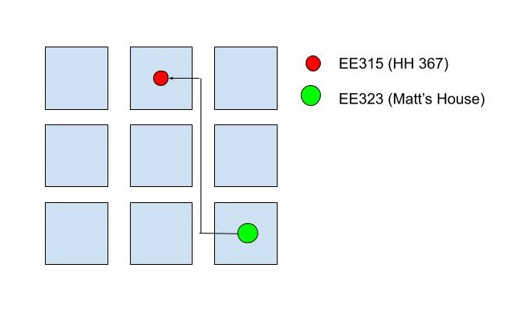

*Authors: Matthew Sahara, Willy Chang*

## Overview
*The problem:* On the first day of school, especially for students who have never been on the University of Hawaii at Manoa’s campus before, students can find it difficult and confusing to locate where their respective courses are being held.

*The solution:* The UnearthHM app will provide an intuitive and user-friendly interface to quickly find the locations of users’ respective classes and where they should head to next. Together, we can solve the mysteries of the first day of school and *unearth* the extent of great education at *UHM*.

## Approach
To use UneartHM, the student will need to register for a new account. Once the account is created, the student will be able to add the courses they will be taking and these courses will be listed on a weekly calendar for the student to see. The students will be able to edit and add other events to this weekly calendar as well.
Additionally, the student will be able to open up a map of their schedule, where they can select the day of their class, and a guide will be displayed on the UHM map to show where the students will need to go for their classes.
Admins can monitor the classes/events being added to all user’s schedules.

The above picture is a diagram of what we envision the UneartHM app to output based on a given user's course information.

## Mockup page ideas
Some possible mockup pages include:
- Landing page
- User home page
- Admin home page
- User profile page
- Campus map specific to user profile

## Use case ideas
The completed, step-by-step use of the application is as follows:
- A new user registers for an account, providing necessary personal information.
- The user can then log in and is redirected to the homepage, where a tutorial is available, and all their classes/events can be seen.
- The user then adds their classes/events to their schedule.
- The user can see the shortest path they can take on certain days to reach their destination.
- Admin goes to the landing page, logs in, goes to the home page, edits site.

## Beyond the basics
Beyond the foundation of this application as described above, additional features that can be implemented are the following:
- User has prioritized notifications that alert them if there is any construction in the way of their class paths.
- Display classroom information that shows logistical details (i.e. number of power outlets, data jacks).
- Page to easily report classroom issues, such as a lack of or broken equipment.
- Admins can add obstacles (e.g. construction) that may happen across the campus.
