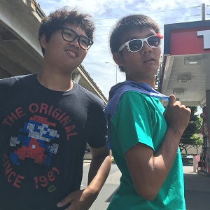
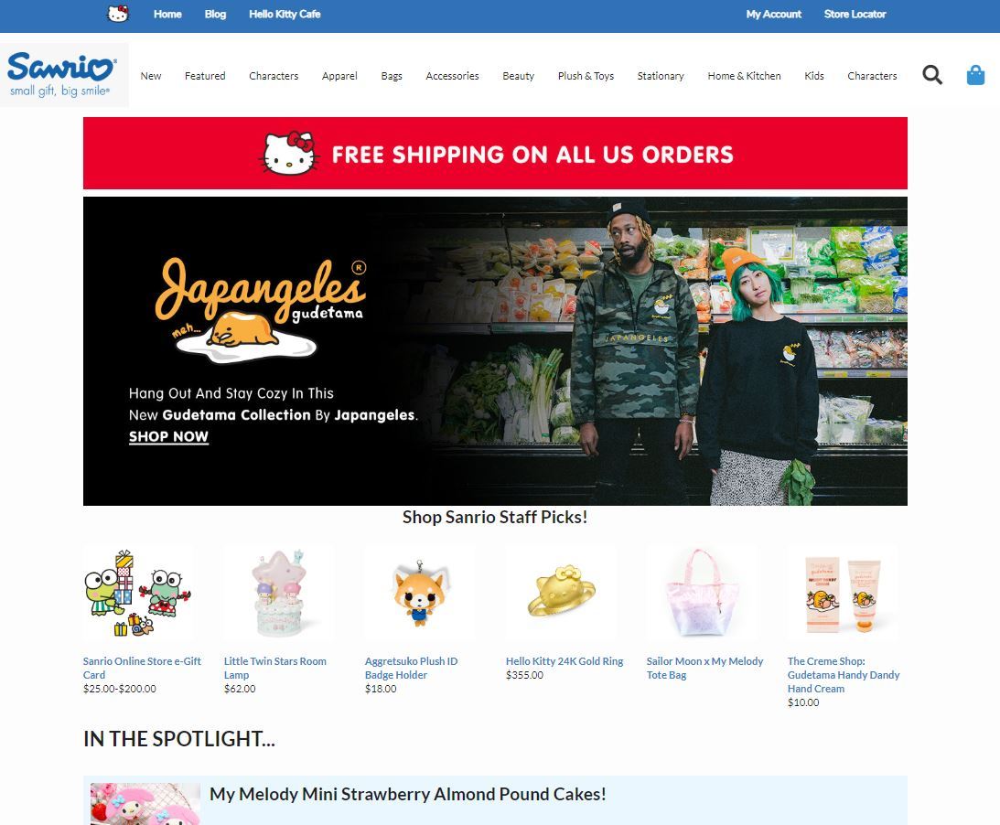
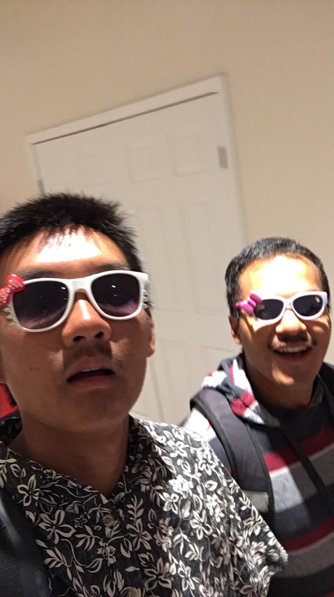

## Hello There



Hello Semantic UI! This was my first exposure to a framework. Learning to work with the Semantic UI framework was honestly quite tough for me. Coming in with little to no experience, the previous HTML and CSS course module was a very brief crash course. Semantic UI was a lot easier to write, but it took some time for the framework to start becoming intuitive. It was very helpful in the replication of a website for practice. I my case, I was able to replicate the Sanrio website, which is the company behind the iconic, Hello Kitty. As a child, I would always love Hello Kitty and friends. I still remember being very happy to get a Hello Kitty watch from a Happy Meal when I was in elementary school. Similar to my feelings about Semantic UI, this report may seem full of disappointment at first, but it will slowly start to make sense and express joy as we progress.

## Full of Disappointment?


We began this module on frameworks with three grueling hours of videos on Semantic UI. I spent the bulk of my time trying to install Semantic UI locally on my computer. I spent at least a couple of hours trying to reconfigure my settings on Windows and troubleshoot. It turns out I simply needed to insert references in my index.html header to link Semantic UI via the web, instead of having a local file system copy, as the downloadable version is no longer maintained.

Watching the videos about Semantic UI, the first thing I thought to myself was, "Oh, this is the same thing that we use for images in our Techfolios and essays!" I was actually very excited that I finally would learn and understand how to modify media references in my essays.

Software tools in this class and I usually have quite the rocky start. It was no different in this case. However, as time progressed, I saw the benefits in how intuitive it was. Because it is a framework, it has great potential to speed up the development process, and it can be optimized even more when the terms are easy to remember and understand. We can look at an image tag as an example:
```

```
I can easily and intuitively increase the size of my Hello Kitty image by changing the "big" in class to "massive". I feel that Semantic UI is generally easy to remember, but slightly more complex concepts, such as manipulating grids, took me time to understand and learn how to make proper modifications.

## Hey Kitty, Kitty!
As one of the assignments this past week, our task was rebuild a site of our choice, using Semantic UI. My choice was to replicate <a href="https://www.sanrio.com/">https://www.sanrio.com/</a>. I have to be "San-real" with you—it turns out that the Hello Kitty by Sanrio website had the most "locked down" code that I have ever seen in source code for a webpage. It all began when I attempted to use image links and match colors used by the original website. The code was very compact and in a sense, obfuscated. I had issues with referencing the same links that the Sanrio website used itself. To overcome this, I had to comb through Google Images to find similar images to link into my code.



Overall, I was able to successfully replicate select sections of the webpage. A screenshot of my Semantic UI copy is shown above. Although I was not able to perfectly match everything using Semantic UI, I think that my copy looked reasonably close to the original Sanrio website.

Link to Repo: <a href="https://github.com/saharama/sanrio-semantic-ui"><i class="large github icon"></i>sanrio-semantic-ui</a>

## Friend or Foe?



Like the countless other software development tools in this class, I once again had a problematic start with the Semantic UI framework. As the week progressed and I became more familiar, I found Semantic UI to be incredibly helpful. Once I developed the correct way of thinking, Semantic UI helped to expedite my web development speed significantly. Just as my replicated website was not a perfect replicate, the two "Hello Kitties" in the adjacent picture are not perfect copies either! I was happy to be able to replicate the Hello Kitty by Sanrio website, as it was an old childhood character that made me happy. Hello Kitty helped me to say Hello to Frameworks.
