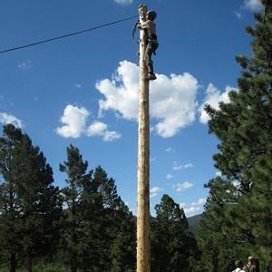

## Introduction

Aloha, my name is Matthew Sahara! I am studying Electrical Engineering, Electro-Physics at the University of Hawaii at Manoa. I have taken courses in the C and C++ languages. Last week was my first introduction to the Javascript language. It seemed very easy to work with, and the exercises on freeCodeCamp helped to boost my confidence, and subsequently my ego, in my Javascript capabilities.

If you want to take a look at my final C++ project, here is the link: [My Github C++ Repo](http://github.com/saharama/EE205_FinalProject).

## Javascript versus My Native Tongue

I thought Javascript was my passion, but I do not think it is anymore.

Just kidding. From a software engineering perspective, it seems to me that Javascript is very useful. Being a high-level language, it is relatively easy to turn thoughts into code. It is also very flexible and seemingly intuitive.

Coming from a background in C and C++, the syntax in Javascript was relatively easy to catch on to. However, Javascript seems to have a significantly higher amount of internal functions and operators, compared to C++. It also treats certain elements, such as strings, very differently, which can cause personal confusion and distress during Javascript-oriented WODs.

## My Software Marathon Training



I can climb that tall pole while hanging on for dear life. I can run 2-miles in 14-minutes. However, these "athletic" Workouts of the Day (WODs) have me out of breath, more than ever before. The practice WODs helped to get me much more comfortable coding in Javascript, while under a time limit, and consequently, under pressure. This was good practice for the actual WOD situation, and I felt that I was well prepared in terms of working under pressure.

In high school, I was in the Air Riflery program. When you are at the firing line, you must be as relaxed as possible when you aim and shoot the pellet at your target. At times, you start spacing out and getting frustrated. The best thing to do at that time is to take a step back, breathe, and collect yourself. The practice WODs reminded me to simply take a deep breath while in the midst of frustration and break the problem down into different layers and pieces.

The practice WODs, especially the bWOD, showed that there were large gaps in my ability to implement certain structures and algorithms to solve specific problems. In C++, most of my labs were focused on stressing object-oriented features of the respective language, so I was slightly lacking in experience related to standard "cut-and-paste" methods of creating and applying common functions. 

## WOD Preparation

I did both practice WODs. I was able to solve the Practice WOD #1 on my first try in 5-minutes and 33-seconds. My first try was very "hard-coded" in the sense that I had not defined a function. I simply used a for-loop in my code and changed the values. Based on the feedback from my instructor, I learned the value of code flexibility when creating functions to solve problems. I repeated the practice WODs with a fresh mind, and I was able to solve the problem a few seconds faster every time.

The code from my first attempt at the Practice WOD #1 is down below. You can see that is hard coded, and I had to end up changing the for-loop condition to account for different inputs, which wasted valuable time and was not very intuitive to the average user.
```js
let sum = 0;

for(let i = 1; i < 1000; i++) {
	if(i % 3 == 0 || i % 5 == 0) {
  	sum += i;
  }
}

console.log(sum);

```

My TA, Branden Ogata, holds weekly practice sessions. His WODs are called the bWODs. The bWOD this week dealt with sorting through arrays and comparing values. I was not able to finish on my first attempt. I was confused with the syntax of arrays in Javascript. After talking to Branden, we figured out that my code was not the biggest problem, but my computer was not functioning properly. I thought I was quite bad at Javascript, but the console was not giving any output, not even an error message. Later, I went home and a 30-minute Windows 10 update was able to fix my computer! I am glad I caught this problem during a bWOD and not during the actual exam.

It took me a long time to finish Practice WOD #2. Specifically, I took over 17-minutes. This was well beyond the allotted time; however, I was proud that I was able to figure it out by myself. Practice WOD #2 was a question about the Fibonnaci sequence. I knew how to do it, but I initially started with too many variables. I ended up confusing myself. I had to take a deep breath, and break down the problem piece by piece to figure it out at the end. Once I worked out the math, I was able to finish the WOD consistently under 5-minutes. I stopped freezing up, and I carefully designed my function by focusing on the task at hand. The problems give you implicit details at specific inputs and outputs of the function. I need to initally read and process problems with a level-head in the future.

I spent a lot of time practicing the assigned Practice WODs. In retrospect, I should have reviewed the exercises in freeCodeCamp to get a better feel for Javascript. I was so focused on the implementation portion of the WODs, but what I actually needed to focus more on my fundamentals.

## The Final Countdown

I was having a good day, and I felt as read as I would ever be for my first ever WOD. I walked into class, joked around with my friends, and Professor Johnson was playing some nice music to ease our nerves. The prompt comes up. We have to replace all spaces in a string with double spaces. Then my mind goes blank.

Thanks to the practice WODs, I am able to deal with this frustration. I take a deep breath, and I start to think about the problem. I come up with the idea that I have to parse the string, detect the space, and shift all the characters over to insert another space. Big mistake. I was not able to finish in the time allotted. My C++ approach to the problem was not the right method to write my function. I later learned that you can simply use the += operator at string indexes to add in characters. My original approach was flawed because according to Branden, Javascript strings are immutable. My shift would never have worked.

Commented out of my code, I used the .replace() function at first. It was also later revealed by Brandon that my version of the replace() method would only replace the first detected character in the string. I did not know the details, but personally, it was nice to know that I was headed in the right direction.

Later in the day, I was talking to some of my Computer Engineering friends. It seems like many Computer and Electrical Engineering majors were unable to complete the WOD in time provided. I have a feeling that many of us tried to parse the string in a C-programming-like fashion. My Computer Science peers told me that the character concatenation, when dealing with strings, is commonplace in Java. It feels like we were at a disadvantage for this WOD, but it does not matter. Hype is fake, but results are real. In order to stand along my Computer Science counterparts, I will have to study twice as hard as them and work ten-times more efficiently! Challenge accepted.

## My Last Cup of Joe


Overall, I find ICS314 to be a class that keeps me on my toes. It seems to be a lot of work, but the work is not too hard. I enjoy the "flipped-classroom", and it helps to keep me engaged. I am concerned about my ability to complete future WODs, specifically because I do not currently have an extensive background in program structures like my peers. It will take consistent work and a lot of time; however, success is not a sprint, it is a marathon.

I will make sure to digest the syntax and associated caffiene of this useful and flexible language. I look forward to the object-oriented Javascript module next week!


