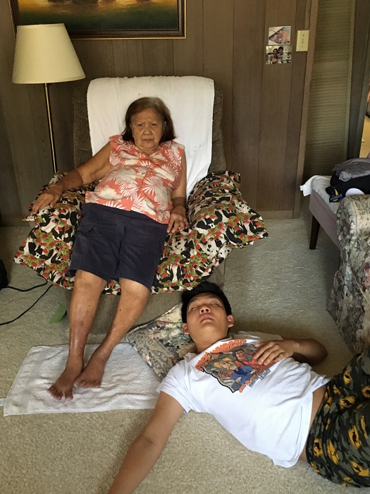
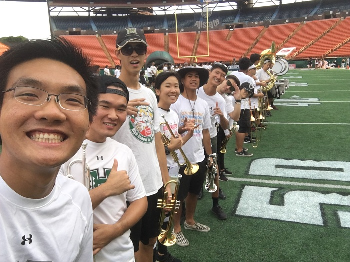

# Draft

The Covid pandemic has disrupted global human civilization. But how has it disrupted you? It can be therapeutic to spend a little bit of time reflecting on how your life has changed in the past few weeks and to think about how you might best move forward in the face of great uncertainty.

In your essay, discuss how Covid has impacted upon your life as a college student. You can discuss anything of importance to you; here are some potential topics:

## Regular Days
Hey! Your average extroverted-introvert here. In a normal day, I am usually out of the house. I love making people laugh, eating good food, and doing research in the engineering labs. Before the whole situation with the novel coronavirus (COVID-19) pandemic happened

## Daily Routine
What has changed in your daily routine?

My 9:30am class has essentially been cancelled. Now, I get to sleep in until my 11:30am class. I feel a lot more well rested, but I do miss the morning air sometimes.

## Change in School
How has Covid impacted your ability to learn, not just in ICS 314, but also in any of your other classes?

COVID-19 has actually made it easier for me to learn. By working and learning from home, I am able to save time because I no longer have to commute to school or walk to different classes. In my opinion, the only downside to this situation is that people have been cheating on midterms. While my moral compass does not allow my to do that, it in turn makes curved classes much more difficult for me. I hope that by staying focused, I will be able to earnestly get good grades that I can be proud of this semester. In addition, my Engineering professors have sent prewritten notes or slides to make up for the lack of a physical whiteboard. This helps because I can spend more of the time focusing on the material being taught.

## Additional Responsibilities
Thankfully, my current work obligations remain the same. I have to put a lot more time into distance learning preparation as a Teaching Assistant for my EE160 lab section. I am also able to meet virtually to discuss code and networking concepts, as a Research Assistant. I am very fortunate to retain my part-time work through this pandemic, as I know many people are facing unemployment.

For the past couple of years, I have been the primary caretaker for my grandma. With the regular school year, I am very busy, and I am only able to

I recently joined a Slack group called Helpful Engineering, which is an international effort to produce low-cost solutions to healthcare problems and resource shortages. I am hoping to join a development team and do what I can to help make a difference in the middle of all of this chaos.

## Family Time
What new things have you learned about yourself, your family, your friends, and your community?

## Moving Forward
What changes do you think you need to make in order to move forward successfully?

In order to move forward successfully, I

