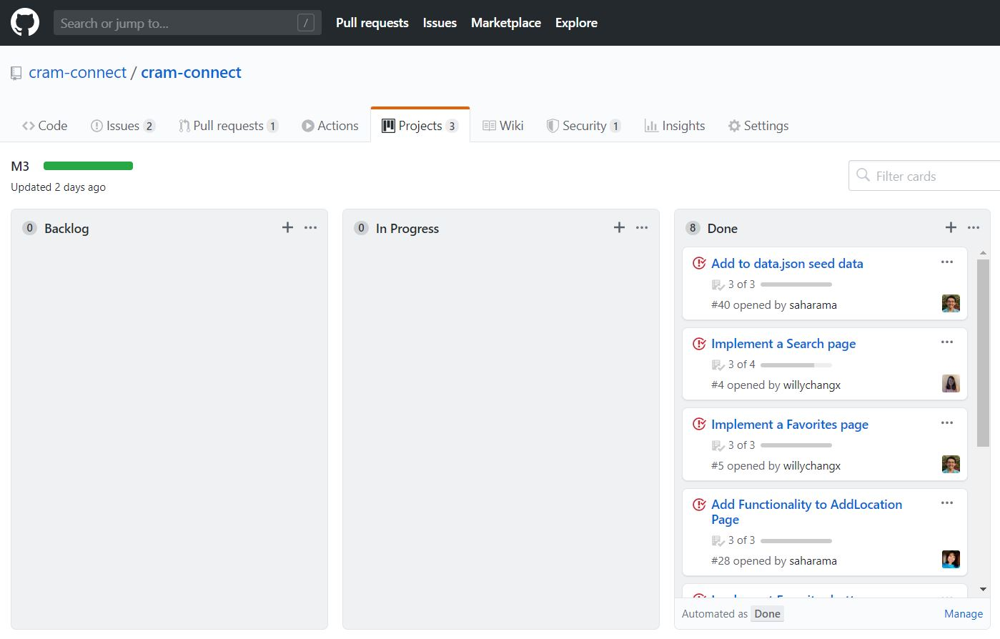

If you are reading this,

I am not finished yet sorry pls spare me

## Let's Get Down To Business

In the well known movie, "Mulan", the main character Mulan sees her reflection in a the pond, in the midst of an existential crisis, and asks herself, "When will my reflection show who I am inside?" In some ways, I feel like Mulan in relation to the ICS314 athletic software engineering experience. At the beginning, I was reluctant to take this class because I heard that it was a lot of work, yet the results were great. Looking back at my former self who could only code in C++ and share code primarily on Google Drive, we have come quite the long way. I have learned countless things in terms of web development, but more importantly, about fundamental software engineering concepts that I can apply to further improve other aspects of my education and research.

If you are not familiar with the animated movie, Mulan, take a listen to the song *Reflection* at [https://youtu.be/lGGXsm0a5s0](https://youtu.be/lGGXsm0a5s0){:target="\_blank"}, as I make some significant song references thoughout this essay.

## Standing Up For Standards
In the beginning of the movie, Mulan is largely criticized by her matchmaker who claims that she does not optimally meet any of the criteria set forth for a "perfect bride". Take a look at the following scene:

<iframe width="560" height="315" src="https://www.youtube.com/embed/bPa0TiCuvR4?start=127" frameborder="0" allow="accelerometer; autoplay; encrypted-media; gyroscope; picture-in-picture" allowfullscreen></iframe>

One of the modules in this class focused on *Coding Standards*. Just like how the matchmaker points out Mulan's flaws in an earlier part of the video, our tool ESLint points out my flaws when I code in Javascript. Essentially, a lint is a tool that acts like a spellcheck, but for code. In addition to error-checking, the ESLint tool also helps to standardize how we write code and checks for certain stylistic qualities, including spaces. This is similar to if Microsoft Word flagged sentences missing the Oxford comma, or if someone put two spaces after a period between sentences. ESLint is a great tool to help aid software developers and vastly increase the readability of code. I also learned that there is lint software available for a muiltitude of languages, so I hope to continue my relationship with lint in the future.

## Index of Refraction
In physics, an index of refraction is a value that characterizes the reflectivity of a certain material. Basically, if I put water and maple syrup under a light, different amounts of light would be reflected off of and transmitted through each liquid.
- functional programming
- User Interface Frameworks

## I'll Make a Man(agement) Out of You
A vital part of this class turned out to *Agile Project Management*, which essentially is the concept of breaking down the project into smaller tasks and systematically tackling each task to aid with efficiency of development and quality control. In our project, we used a certain style referred to as *Issue Driven Project Management*, in which we used a Kanban project board to manage issues or tasks that were to be discussed and determined during team meetings. A Kanban board has three columns that consist of backlogged, in progress, and completed tasks. Note that additional columns can be added for priority organization. When taking on an issue, we move it to the *in progress* column, then we move it to *completed* after we are finished. In our implementation of *Issue Driven Project Management*, we would do work in separated branches corresponding to each issue number for organization. Each issue was defined to be approximately 72 hours of work, to breakdown the workload and keep the sections of work small enough that we could build off of each others' work in a timely manner.

I find that this form of project management is very efficient. I hope to implement *Issue Driven Project Management* using Github project boards for my research work where I work on a team to produce Python scripts to parse drone-based network data. Honestly, we have not been the most organized and our teamwork is not always the best. I feel that we can use issues to communicate our progress better and consequently propel our project forward to get more work done at a quicker pace. Additionally, this could also even apply to working in teams outside of software engineering. Regardless, a Kanban board is very useful in many situations. I remember my friend having a huge Kanban board made out of blue painter's tape and post-its to manage his entire life! Again referencing the Mulan movie, Mulan secretly joins the Chinese army as a woman. During their training, they sing a song with the final lines, "I'll make a man out of you!," before going to fight the army of Huns. They, too, could have used *Agile Project Management* to communicate tasks and prepare for war very efficiently.

## Who I Am Inside
I think that the most important takeaway from this class is how to develop a consistent study schedule for success in academics. In this class we experienced *athletic software engineering* where we were given software-based assignments nearly everyday. This was very different, as one of my previous professors used to say it was actually more efficient to work on code in larger, more concentrated chunks of time. On the contrary, this class helped to make it clear that slowly tackling concepts day-by-day is much more beneficial, at least for me and the majority of other individuals. As I expected to, I learned a lot about using tools to produce quality software as part of a team. However, this class also helped to develop my attitude and work ethic as a student. Actively applying *athletic learning* to all of my classes truly helped me to become a better student, and I am forever grateful to Dr. Johnson and his ICS314 class for teaching me how to learn. The old quote by Maimonides, a philosopher, says, "Give a man a fish and you feed him for a day; teach a man to fish and you feed him for a lifetime." ICS314 has taught me how to learn more efficiently. Maybe now instead of seeing my reflection in the water like Mulan, I can finally start to see the fish.
