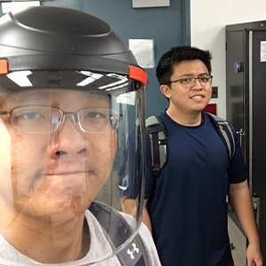
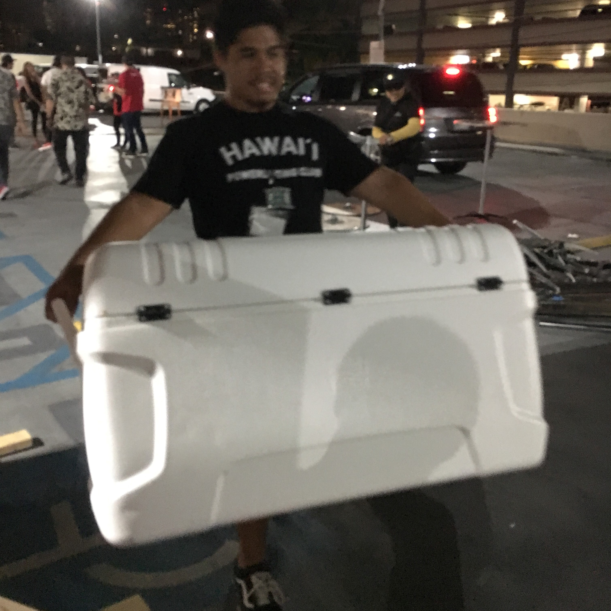

## My Sneaky Friend Named Javascript

I absolutely enjoy the Spring semester. It always feels as if there is more time to dedicate to my classes. As a student in the College of Engineering, I have experience with C, C++, and Python. I have very minor experiences with Javascript, but it does not appear to be too difficult. In respect to C and C++, Javascript is not too different. There are slightly different rules that can be very confusing at times, but overall, Javascript has been quite intuitive. It is important to note that the suble differences could turn out to be major problems. For instance, we are able to modify strings, like arrays, in C and C++; however, in Javascript, strings cannot be modified.

The ES6 features that we learned about were slightly difficult to remember, but I see how they can be useful to optimize code. My initial reaction to the ES6 functions were similar to that of my face in the above picture. Upon closer inspection, they seem to have a lot of potential benefits—if I am able to become more comfortable with them over time. 

## The Critic's Corner
I think that Javascipt is definitely a good programming language because I believe that Dr. Johnson is a reasonable and intelligent professor. I am not just saying that for a good score on this essay. All jokes aside, I think that Javascipt is generally easy to understand. Looking ahead at the future work for the class, it seems that Javascript can be object-oriented and has built-in functions to expedite the coding process. Noting that most benefits in life are associated with a trade-off, we find that an optimization of coding by using built-in functions leads to a higher level of potential difficulty when learning the language. I have seen the benefits of object-oriented code in my C++ projects, and I look forward to implementing similar concepts using Javascript in the coming week. I am slightly concerned about the functional Javascript module, as it looks very long and complex.

## What Season Is It?
In this class, we follow a training regimen to keep ourselves in-shape to learn about software engineering. This style of learning is sometimes stressful. Coming from the engineering program, I am accustomed to weekly homework assignments that I can move around to fit my extracurricular schedule. Having assignments due nearly everyday has been slightly overwhelming. This past week, we had two practice Workout of the Days, or WODs, which challenge us to tackle problems with code. I also went into for extra WOD practice with the ICS314 TA. I was able to finish the two assigned WODs within 8 minutes (7:34) and 9 minutes (8:20), respectively. These were the times of my second attempts for each WOD. The first attempts for both WODs were produced in time; however I was having issues with my development environment in JSFiddle and Google Chrome, as my console was not producting any output. Upon a computer restart, the same JSFiddle link was able to run the code. Although I was unhappy that I did not have an accurate time for both first attempts, I was happy that I was able to sort out my environment issues before the actual in-class WOD.

I have to admit that I have not had much exercise in the past couple of months. However, this past week turned out to be quite the workout! Thanks to ICS314, I have learned a very important lesson about retention of information. I plan to apply similar athletic learning to all of my classes. This method of learning helps to keep me on my feet, and it forces me to be constantly thinking about relevant concepts throughout the week.

At the end of the week, I look back at all the muscles that I gained from the Javascript workouts. What season is it? It is bulking season.

