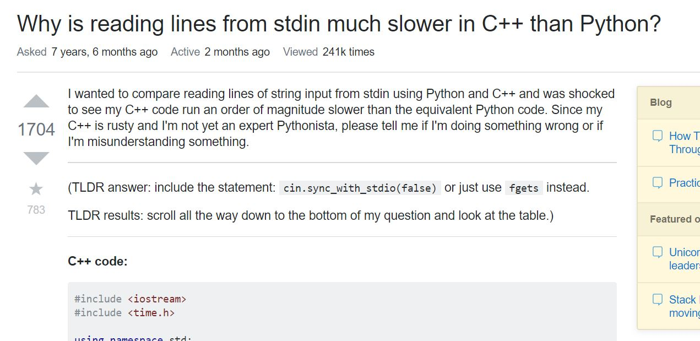
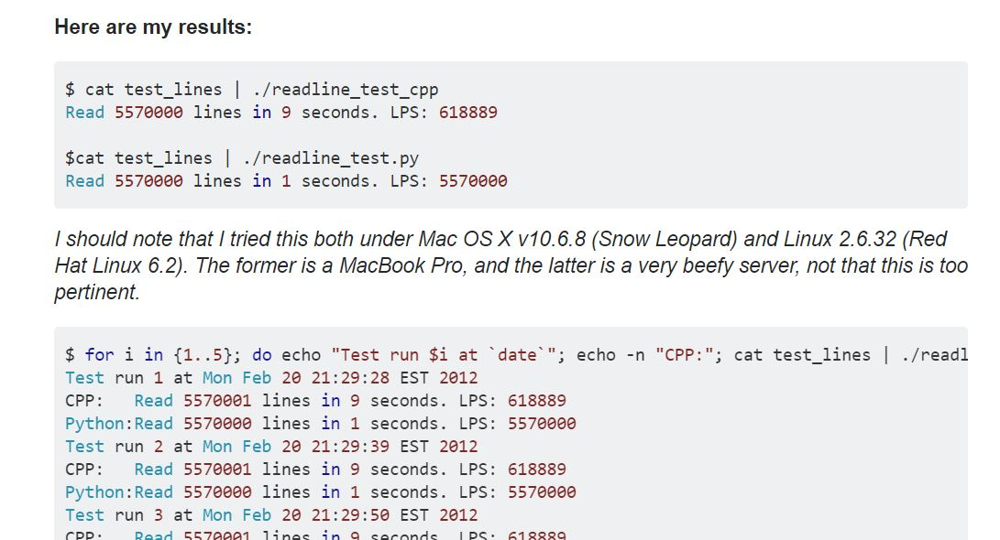
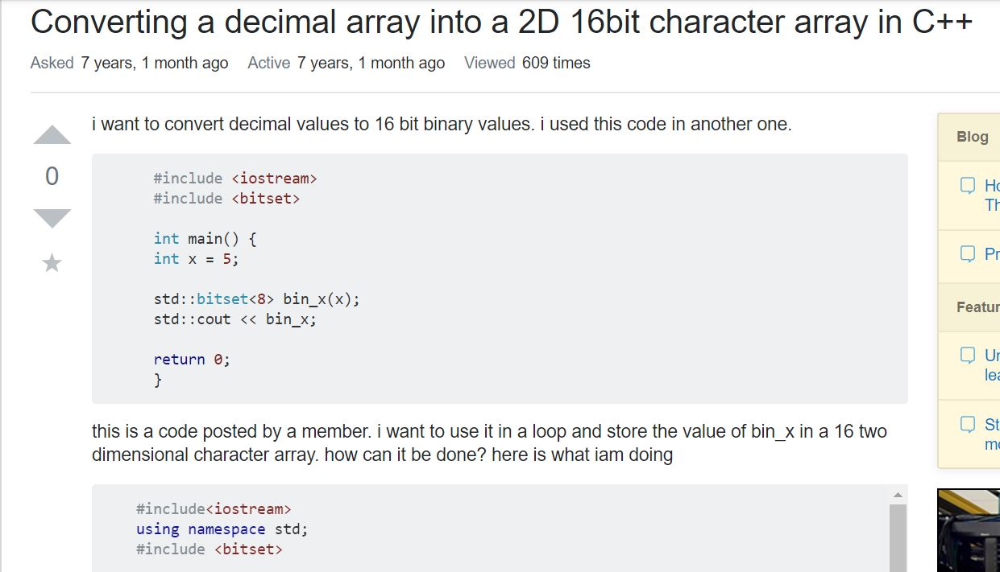
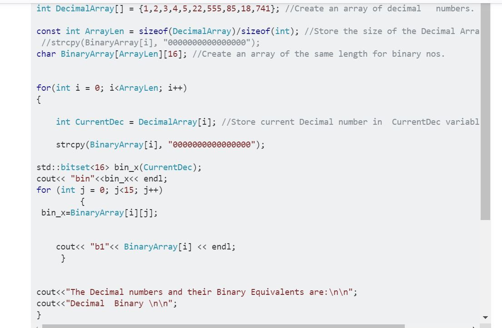

## Play it Smart

Marching band is similar to software development. Break down your task into smaller elements, and tackle each one individually. I play the trumpet in the University of Hawaii Marching Band, and I find many of the processes in both software development and band to be quite similar.

In the words of a wise marching band conductor: "I have a theory. People talk loud when they want to sound smart, right? Maybe if we play loud, people will think we're good." (Squidward Tentacles, 2001).

If developers ask smart questions, they appear smarter. Not only do "smart-questions" explain problems and symptoms clearly, but they also show a certain threshold of respect and willingness to learn towards the programming community. Great concise questions will entice others to contribute toward a great solution.

## Asking like a Pro

We first take a look at a question that showcases great question format and proposal. We also note that this user clearly states their troubleshooting attempts and mentions certain details that pertain to "symptoms" of respective programming bugs. The user asking the question clearly defines the different types of Operating Systems they used to compile, or interpret, the programs listed in the question. Although there are many good points in the question, the title could be slightly more precise to get straight to the point.

Example of a good question: <a href="https://stackoverflow.com/questions/9371238/why-is-reading-lines-from-stdin-much-slower-in-c-than-python"> Reading lines in C versus Python</a>

In this excellent example, the inquirer clearly states the question and attaches screenshots of relevant code. The question is blatantly listed and asks about execution timing of input reading between the C++ and Python languages. Looking at the projects section of my website, I hint that those are my two favorite languages. That is partially why I chose this question.

What truly stands out is the fact that the author continued to update his post. The author inserted a summary of the correct solution to the issue near the top of the description. The author of the post also keeps his language very humble and open-minded which shows some courtesy towards potential aids.

Consequently, this post received many great responses. Because of its inital clarity of both question and details, this question was able to get a significant amount of thoughtful information and solutions.

## Back to the Drawing Screen

Now we view a question that needs some work. The author of the question asked for help with a program to convert numbers. The author decided to ask the question and post large snippets of code into the question, showing little-to-no higher level thinking.

Question needing work: <a href="https://stackoverflow.com/questions/11819536/converting-a-decimal-array-into-a-2d-16bit-character-array-in-c"> Converting arrays</a>

Proper capitalization and grammar would give the author a little more credibility and consequently, show some respect towards the StackOverflow community. It is good that the question is straight to the point; however, there are no details at the author's attempt at a solution. There are large chunks of code pasted into the question, which do not come with much explanation.

The author of the post does not show the current output of the function. When drafting the question, the author should show, or at the very least explain, the outputs and lessoned learned from prior attempts to debug.

As we can see in the responses from the community, the initial and unclear question led to many more requests for information from the individuals attempting to help this developer. This led to a delay in response and confusion on both sides. In addition, the post likely did not have many attempts to answer because of its poor format and lack of initial information.

## Wrap-Up

After searching through many StackOverflow posts online and extracting both extremes of smart-questions, I have gained a newfound respect for those who ask good questions with great attitudes. I feel compelled to add much more detail into questions I add into the future, because I now understand that it can entice people to answer my question, while also speed up the total time it takes to get sufficient help. Before this exercise, I did not think that the StackOverflow community would react differently and be driven to assist posts that exhibit thought and are well explained.

Now, all of these concepts related to posting detailed but concise questions make sense to me. I am now much more aware of the social incentive and corresponding benifits that come with smart questions.
