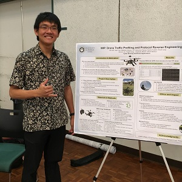

## It's Just Me and Software Engineering

My name is Matthew Sahara, and this is a reflection on interests and how they relate to software engineering. Before I can explain that, let me tell you a little about myself!

I am majoring in Electrical Engineering in the Electro-Physics track here at the University of Hawaii at Manoa. I am taking this class to fulfill my Engineering Breadth and Writing Intensive course requirements. A significant number of my ICS peers recommended this class to me. They warned me about the heavy workload, yet they suggested I take it because of the lessons and skills to be gained from ICS314.

As detailed throughout my technical portfolio, I have mild experience with C, C++, and Python. My friend got me into experimenting with HTML and CSS using my personal webpage via the UH UNIX system provided by the University. My friends complained a lot about this class, so I am here to prove that I can do this, too.

## Software? We are just Friends.

I am supposed to talk about my interests in software engineering, but my interests do not necessarily focus directly on developing software. As shown on my technical portfolio, my main interests are in that of Power Systems, RF and Microwave Wireless Communications, and Network Security. I am very interested in these fields because in one layer of application or another, they are the backbone for keeping people communicated and connected. I would love to play a little part in the big world of helping to connect people.

## It's Electric!

In these modern times, computers continue to play a crucial role in our everyday lives. In addition, many of the current big industries are using computers to automate techniques and increase productivity. Recently, I went to a talk about signal processing equipment in the RF/Microwave spectrum, and I was suprised to know there is a high demand for prospective RF engineers that are proficient in programming in Python! 

Some of the most popular simulation programs in the Power industry are quite outdated. This is ironic, because these simulations help us to provide the correct equipment to keep everyone safe. One day, I possibly hope to aid in the development of a more user-friendly power systems analysis and simulation software to make the jobs of thousands of engineers much easier.

## Onward and Upward

My future may be bright (electrons, photons, and such), but I have yet to figure out what I want to do. Regardless, knowing how to develop software, especially on a team, may prove to be quite the skill in the future. At the very least, at the end of this class, I hope I will be able to understand my Computer Science friends when they complain about their workload. I always used to think they were "softies" for complaining how difficult ICS311 and ICS314 were. Now that I am taking ICS314, I understand that they have been telling me the truth. I look around my class, and I think to myself—"Soft... Where?!"

