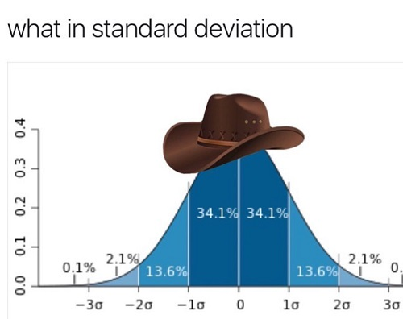
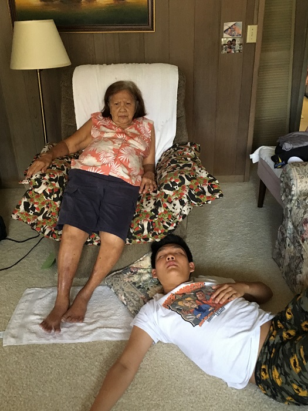
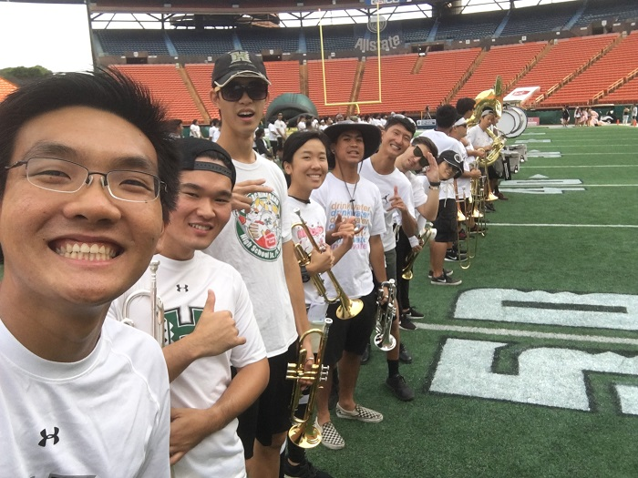

## What in Standard Deviation?

Hey! Your average extroverted-introvert here. In a normal day, I am usually out of the house. I love making people laugh, eating good food, and doing research in the engineering labs. Before the whole situation with the novel coronavirus (COVID-19) pandemic happened I was enjoying life. My classes were interesting, I was making good progress on my projects, and most importantly, I was eating poke at Off the Hook with my friends every week.

The well known picture "What in standard deviation?", from KnowYourMeme.com, pokes fun at the exclamation, "What in tarnation?". On the contrary, the US statistics related to COVID-19 are no laughing matter. The worst is definitely yet to come, and there are still deviants playing around outside, in the midst of a social-distancing campaign to control the current pandemic. Personally, I have tried to do my part to isolate myself, along with my family, and it has not been nearly as bad as I had originally expected!

## University of Zoom at My House

COVID-19 has actually made it easier for me to learn. By working and learning from home through video conferencing platforms, such as Zoom, I am able to save time because I no longer have to commute to school or walk to different classes. To help with the environmental shift, my Engineering professors have sent prewritten notes or slideshows to make up for the lack of a physical whiteboard. This helps because I can spend more of the time focusing on the material being taught. In my opinion, the only downside to this situation is that academic dishonesty is not controlled. I hope that by staying focused, I will still be able to earnestly get good grades that I can be proud of.

For the past couple of years, I have been the primary caretaker for my Popo, which means 'grandma' in Chinese. Since self-isolation measures have been enacted, I have been able to spend much more time with my Popo. Little did I know, this would be a double edged sword. My Popo does not have the best memory anymore, and sometimes it takes all of my patience to remain calm. Every morning, she asks me if we are going out to dinner, and every morning, I have to explain to her that it is not possible to go out because of the pandemic we are facing. She also has trouble understanding how my school can be completely online. Every night while I am up studying late, she is bothered that the light is on, and she tells me to go to sleep every fifteen minutes. This has definitely been a bonding experience, to say the least.

## Additional Responsibilities
Thankfully, my current work obligations remain the same. I have to put a lot more time into distance learning preparation as a Teaching Assistant for an EE160 lab section. As a Research Assistant, I am also able to meet virtually to discuss code and networking concepts. I am very fortunate to retain my part-time work through this pandemic, as I know many people are facing unemployment.

I recently joined a Slack group called Helpful Engineering, which is an international volunteer effort to produce and engineer low-cost solutions to healthcare problems and resource shortages. I am hoping to join a development team and do what I can to help make a difference in the middle of all of this chaos.

## Contemplating COVID-19
In the end, I have been able to work more efficiently, and spend a lot more time with my family. We have been able to eat dinner together a lot more often, since all in-person extracurricular activities have been cancelled. This new environment helped me to become a lot more productive than before. I cannot help but feel a little sad that I may not see some of my friends after they graduate in May; however, I understand the importance of social-distancing in this dire situation. More importantly, the odds are not in my Popo's favor if she ever catches this virus. I have taken all the necessary precautions on my end, and I can only hope that individuals do not deviate from the policies enacted to save us from COVID-19. After this is all over, I look forward to seeing my friends. Hopefully if all goes well, I will pass my probability class this semester, and not need to learn about standard deviation again in the Fall! 

