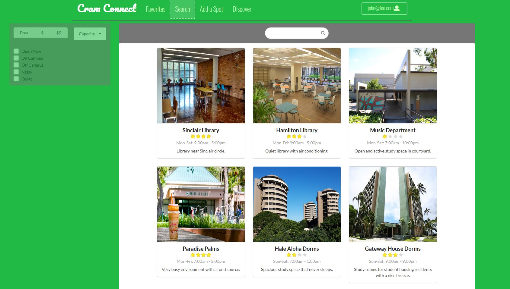

## Application Overview
Cram Connect Github Organizational Page:
[https://cram-connect.github.io/](https://cram-connect.github.io/)

## Matt's Slice of The Cake

In our Cram Connect development, I feel that one of my biggest contributions to our project was setting up the data model. Our data model was designed in the same way as [Bowfolios data model](https://bowfolios.github.io/#data-model). Essentially, the default information for our system was based on Users and Locations and their associated individual data. We then fed this data into our system and stored it as follows. You can think of the combined collections of data, including *ProfileQualities*, *ProfileLocations*, and *LocationQualities*, as associative links between *Profile*, *Location*, and *Qualities* collections stored on the server.

Below is a diagram of the data model that I implemented for Cram Connect. Although it may seem easy to use the same general model pattern as Bowfolios, it took a lot of time to truly understand how this particular type of data model was implmented. Likewise, it took a lot of time to implement this into our system. However, I believe this made our data manipulation process much easier in the end.

Using this data model, I was able to implement an Edit Profile page, which would use our new data model and allow the user to input information. The Preferences (associated qualities) and Favorite Spots (associated locations) allow the user to pick from a MultiSelect dropdown to choose their preferences. In addition, I used Sweet Alert to aid in the process and confirmation of new profile image URLs.

I later took on the responsiblity of creating and developing the favorites page.

As another team member was unable to complete the search page, due to pandemic justified reasons, I worked with Willy to complete the base functionality and appearance of the search page. Personally, I was able to debug code and speed up the process by quickly identifying problemantic spots, and I then clearly communicated the specific issues to my group. For instance, we were passing in *location* to a Card.Group component, which would help us to display all of the location information in nice little card boxes. However, I later was able to understand that [location](https://medium.com/@pshrmn/a-little-bit-of-history-f245306f48dd) is a predefined property and passes intrinsic data, including *pathname, search, hash, and state*. Below, you can take a look at the fruits of our labor.

Willy implemented the individual location page himself. I thought he did a really good job, so I wanted to share that here, too.

In addition to these pages, I also put a lot of time into helping to make default data to be input into the system. I used Bowfolios as a guide to add an Assets JSON file to load additional default data into our system, as our original default data file, *settings.development.json*, had a size limit. We initally had problems with deploying the file, as I did not modify the initial condition to prevent the additional data file from being loaded multiple times.

## Teamwork Makes the Dream Work

I learned a lot about *Issue Driven Project Management* as our project was broken down into smaller chunks of work and divded between members. Our Github branch names corresponded to the issues or tasks that we were working on inidividually. We used a Github project board to manage our issue. They were separated and labelled under columns for *backlog*, *in progress*, and *completed*. In the image below, you can see our completed project board for the Cram Connect project.

In our experience this semester, we learned the value of teamwork, especially having to fight the logisitical and personal issues many of us faced from the COVID19 pandemic situation. We gladly helped each other out when needed, and we generally made up for each other's shortcomings. In addition, there were some communication issues within our team, especially with issues that overlapped and that consequently, did not get done in a timely manner. We were able to gradually work on our communication problems throughout the duration of our project, and I feel that we definitely improved. This was quite the learning experience, especially with the implementation of online classes. This was definitely a project and a semester to remember!

<a href="https://github.com/cram-connect/cram-connect"><i class="large github icon "></i>Cram Connect Repo Link</a>
