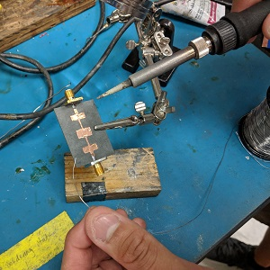
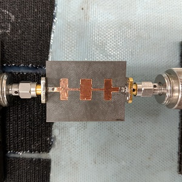
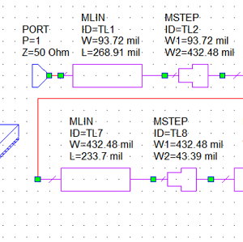
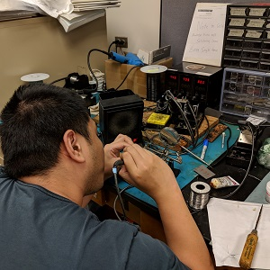

In my *EE473 Microwave Engineering* class, I did many microwave circuit simulations on software called AWR Microwave Office. I looked at the scatttering parameters (s-parameters), which correspond to the electromagnetic waves that enter and leave the individual circuit elements.

Our team worked together to collectively design three types of microstrip filters: Stubbed Low-pass, Stepped Low-pass, and Coupled Band-pass. In our simulations, we had to account for the expected discontinuities of our proposed circuits. Based on our compensated values and calculations, we decided that the stepped low-pass filter would be the best circuit for our group to make.

One of the highlights of this class was being able to fabricate a filter. A filter in electronics will stop all signals from being received, except those at a certain frequency. By using copper tape, we cut our filter to the specifications we designed and mounted the copper on a substrate. We then soldered on SMA connectors for analysis with the network analyzer.

The results from our fabricated filter were very close to that of our simulation. We noted the discrepancies, but the whole experience was very enjoyable, and it was incredibly interesting to get to do hand-ons learning in such a specialized field.

Link to EE473 Syllabus <a href="https://drive.google.com/file/d/0B0yBjGINCgxENWVuZ0o5ZUtBTU0/view"><i class="large light icon "></i> here</a>

  
  
  

