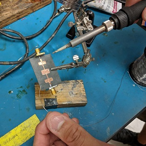
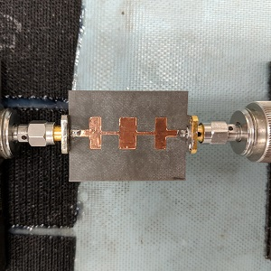
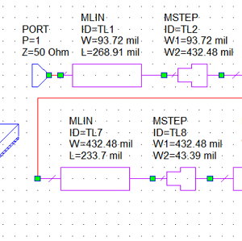

In my *EE473 Microwave Engineering* class, I did many microwave circuit simulations on software called AWR Microwave Office. I looked at the scattering parameters (s-parameters), which correspond to the electromagnetic waves that enter and leave the individual circuit elements.

Our team worked together to collectively design three types of microstrip filters: Stubbed Low-pass, Stepped Low-pass, and Coupled Band-pass. In layman's terms, low-pass filters only allow lower frequency signals to pass through them, while band-pass filters only allow a certain central range of frequencies to be let through. Focusing on the physical shapes and qualities of these filters in our simulations, we had to account for the expected discontinuities of our proposed circuits. In microstrip circuit design, certain parts of the copper appear longer than they actually are, due to the fringing electric fields in the general topology. Based on our compensated values and calculations, we decided that the stepped low-pass filter would be the best circuit for our group to make.

One of the highlights of this class was being able to fabricate a filter. A filter in electronics will stop all signals from being received, except those at a certain frequency. By using copper tape through the *RECiP* technique developed at UH Manoa, we cut our filter to the specifications we designed and mounted the copper on a substrate. We then soldered on SMA connectors for frequency (signal) analysis with the vector network analyzer.

If you are truly interested in our results, take a look at this YouTube video that we made for the class.
<iframe width="560" height="315" src="https://www.youtube.com/embed/zo4CTJzerE8" frameborder="0" allow="accelerometer; autoplay; encrypted-media; gyroscope; picture-in-picture" allowfullscreen></iframe>

The results from our fabricated filter were very close to that of our simulation. We noted the discrepancies, but the whole experience was very enjoyable, and it was incredibly interesting to get to do hand-on learning in such a specialized field.

This class helped to introduce me to RF circuit design, and consequently, I joined the Liquid Metal - Vertically Integrated Project. I have been using my knowledge about microstrip transmission lines from this class to develop different RF devices such as switches and planar coil inductors. More important than the technical side of the project, this class also taught me about a problem solving technique called the HK Method. Using this method whenever I encounter an issue in life, I have learned to break down the problem into its simplest possible form and build the layers of difficulty back on, one-by-one. Dr. Shiroma and his EE473 class played a large part in shaping my problem-solving mindset as an engineering student, and I will be forever grateful.

  
  

