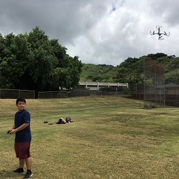
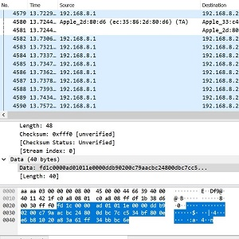
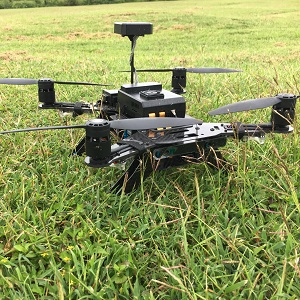

  
  
  

I am currently analyzing wireless network traffic and adapting current software using packet analysis for Unmanned Aerial System (UAS) classification and profiling for my senior design project.

With Kali Linux, I use the aircrack-ng suite to capture wireless network traffic from various UASs that support WPA2 encryption. We can examine more information about the network traffic in the form of packets with the Wireshark application.

Last semester, we were introduced to the Netzob library for help with interpretation and reverse engineering of wireless packets. My team was responsible for modifying Python scripts for statistical analysis of wireless data following specified wireless protocols.

We are currently analyzing trends in the collected data in network Layers 1, 2, 3. 

It was interesting, to me, how this project and my part-time job in the UH Data Center would end up falling hand-in-hand. I feel like my part-time job helped to give me a firm, physical view of networking. I also learned a lot about networks from my coworkers, who would spend time helping me to understand concepts like the OSI-model. Before you can make a network secure, you need to truly understand how it works, first.

In previous semesters with this project, I gained familiarity with the Aircrack-ng suite and related tools using the Kali Linux operating system. (ENGR296/396 credit)

With guidance I was able to crack WEP, WPA/2 encryption with aircrack-ng suite. In addition, we bypassed hidden SSID and MAC filtering.
Most importantly, we used different flaws in wireless protocol to gain access to controlled networks. This includes well known Wi-Fi encryption attacks including Cafe Latte, Man-in-the-Middle, Hirte, Mis-Association/Honeypot attacks.

The main goal was to build a firm foundation of wireless networking knowledge to later be implemented in our senior design projects.

Project Repo: <a href="https://github.com/saharama/UAVClassifier"><i class="large github icon "></i>saharama/UAVClassifier/</a>

